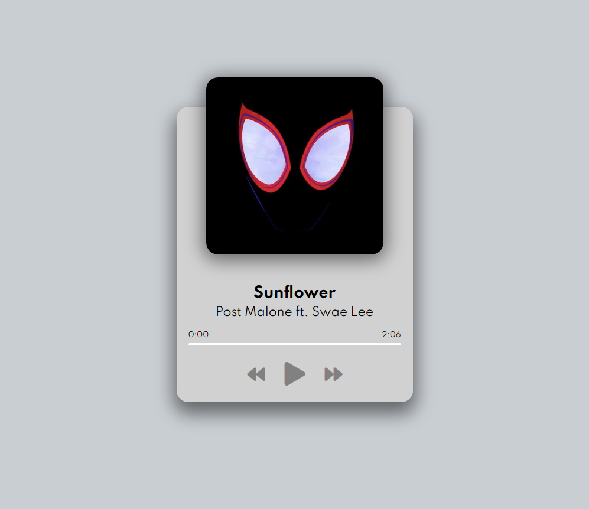

# Music Player

I have always interested in how a music player on a smartphone or a website is implemented.
Through this project, I learned how to work with the HTML audio element and its events.

The music player comes with a playlist, progress bar that shows the current time and duration of the playing song and control buttons to play, skip and come back to the previous song. 

When a song ends, it automatically plays the next song. If the last song in the playlist ends, the playlist will be repeated. You can also click on the progress bar to play the part of the song that you would like to listen to.

The music player is responsive to smaller screen sizes such as that of the iPhone X *(with 375px in width)*

## Live Demo

**Try it out [here](https://tylernnguyen5.github.io/music-player/)**

## Tools I used

- Google Fonts
- [Font Awesome Icons](https://fontawesome.com/)

## How to try it out yourself locally

- Simply clone the project
- Use **Live Server** or similiar extension to view it in the browser